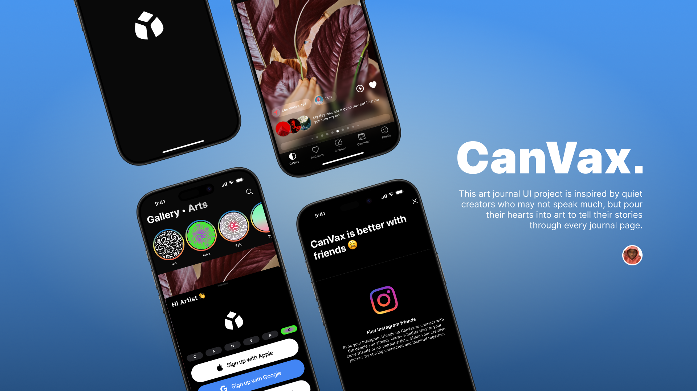

  <!-- Replace with your actual file name -->
# CanVax – Emotion-Driven Art Generator


CanVax is a SwiftUI iOS app that transforms your mood into generative art. Using CoreML, it detects emotions from your facial expressions or written journal entries and renders abstract, expressive artwork using SwiftUI’s Canvas API.

Created by **Valome (Valentine Chimerem Omeje)**

---

## 🎬 Figma UI Kit

> [CanVax UIKit](https://www.figma.com/community/file/1514312932236784293)

---

## 📚 Table of Contents

- [CanVax – Emotion-Driven Art Generator](#canvax--emotion-driven-art-generator)
- [Quick Start Demo](#-quick-start-demo)
- [Installation](#installation)
- [Usage](#usage)
- [Development](#development)
- [Contribute](#contribute)
- [License](#license)

---

## 🛠 Installation
[(Back to top)](#📚-table-of-contents)

```bash
gh repo clone yourusername/CanVax
cd CanVax
open CanVax.xcodeproj
```

Ensure you have the latest Xcode and iOS SDK installed. Run on a real device for camera-based emotion detection.

---

## 🚀 Usage
[(Back to top)](#📚-table-of-contents)

1. Launch the app  
2. Choose input type:
   - "Use Facial Expression"
   - "Write a Journal Entry"
3. Grant necessary permissions  
4. Watch your mood turn into visual art!

---

## 🧑‍💻 Development
[(Back to top)](#📚-table-of-contents)

### Set up locally:

```bash
git clone https://github.com/yourusername/CanVax.git
cd CanVax
open CanVax.xcodeproj
```

- SwiftUI for UI  
- CoreML + Vision for facial emotion detection  
- NaturalLanguage for journal sentiment analysis  
- Canvas API for generative art rendering

---

## 🤝 Contribute
[(Back to top)](#📚-table-of-contents)

Got ideas or improvements? Open an issue or pull request.  
Want to support the project? Feel free to star the repo or reach out.

---

## 📄 License
[(Back to top)](#📚-table-of-contents)

This project is licensed under the [MIT License](./LICENSE).


